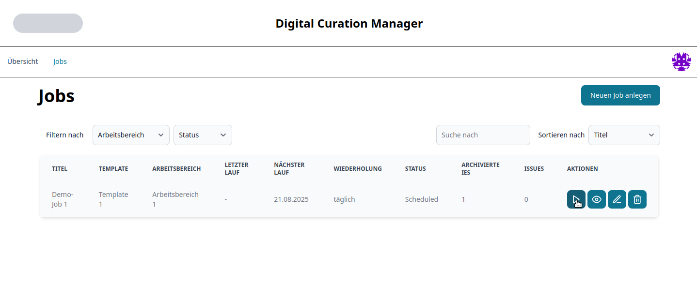
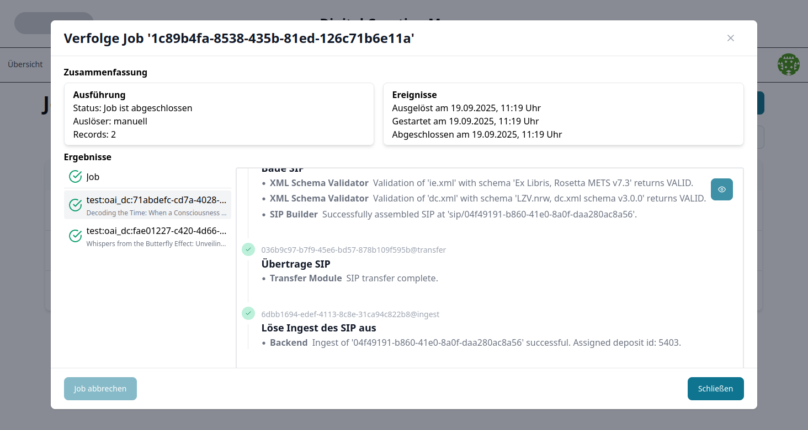

# Digital Curation Manager

This is a meta-repository for the software system `Digital Curation Manager` (DCM) developed in the context of the [LZV.nrw](https://lzv.nrw/)-initiative.

## Software architecture
The following diagram visualizes the top level of the DCM's software architecture:


## Repositories
The following is a comprehensive list of related repositories
* APIs
  * [Import Module API](https://github.com/lzv-nrw/dcm-import-module-api)
  * [Object Validator API](https://github.com/lzv-nrw/dcm-object-validator-api)
  * [IP Builder API](https://github.com/lzv-nrw/dcm-ip-builder-api)
  * [Preparation Module API](https://github.com/lzv-nrw/dcm-preparation-module-api)
  * [SIP Builder API](https://github.com/lzv-nrw/dcm-sip-builder-api)
  * [Transfer Module API](https://github.com/lzv-nrw/dcm-transfer-module-api)
  * [Job Processor API](https://github.com/lzv-nrw/dcm-job-processor-api)
  * [Backend API](https://github.com/lzv-nrw/dcm-backend-api)
* Apps
  * [Import Module](https://github.com/lzv-nrw/dcm-import-module)
  * [Object Validator](https://github.com/lzv-nrw/dcm-object-validator)
  * [IP Builder](https://github.com/lzv-nrw/dcm-ip-builder)
  * [Preparation Module](https://github.com/lzv-nrw/dcm-preparation-module)
  * [SIP Builder](https://github.com/lzv-nrw/dcm-sip-builder)
  * [Transfer Module](https://github.com/lzv-nrw/dcm-transfer-module)
  * [Job Processor](https://github.com/lzv-nrw/dcm-job-processor)
  * [Backend](https://github.com/lzv-nrw/dcm-backend)
  * [Frontend](https://github.com/lzv-nrw/dcm-frontend)
* libraries/other
  * [common](https://github.com/lzv-nrw/dcm-common)
  * [database](https://github.com/lzv-nrw/dcm-database)
  * [OAI-PMH-extractor](https://github.com/lzv-nrw/OAI-PMH-extractor)
* legacy libraries
  * [s11n](https://github.com/lzv-nrw/dcm-s11n)
  * [metadata-mapper](https://github.com/lzv-nrw/dcm-metadata-mapper)
  * [bag-builder](https://github.com/lzv-nrw/dcm-bag-builder)
  * [bag-validator](https://github.com/lzv-nrw/dcm-bag-validator)

## Install packages locally
To install python-packages associated with this project, [configure `pip`](https://pip.pypa.io/en/stable/cli/pip_install/#finding-packages) to use the extra-index-url `https://zivgitlab.uni-muenster.de/api/v4/projects/9020/packages/pypi/simple`.
This can be achieved, for example, by entering
```
pip install --extra-index-url https://zivgitlab.uni-muenster.de/api/v4/projects/9020/packages/pypi/simple dcm-common
```

### Additional requirements
Some service components, like for example the Object Validator's JHOVE-plugin, need additional software to be installed.
Please refer to the relevant project-READMEs for details:
* [Object Validator: JHOVE](https://github.com/lzv-nrw/dcm-object-validator#jhove-format-validation)
* [Transfer Module: openssh + rsync](https://github.com/lzv-nrw/dcm-transfer-module)

### Run locally
A demo-configuration for the application can be run locally by using the contents of the `python/`-directory.
Simply change into that directory, install the required dependencies, and run the starter-script:
```
cd python
python3 -m venv venv
source venv/bin/activate
pip install -r requirements.txt
python3 run.py
```
After all services have started, the frontend web-client is hosted at `http://localhost:8088`.
By default, a demo-data set will be loaded including an administrator (username: `admin`; pw: `admin`) and a few curator-users (see [backend-documentation](https://github.com/lzv-nrw/dcm-backend#database) for details).
API-tests can be run as described [below](#api-test).
All data will be generated in the `data`-subdirectory.
This also includes a hotfolder `hotfolder-0` which is already pre-configured for this demo.
Afterwards, the execution can be stopped with `CTRL+C`.

Alongside the actual DCM-services, two additional servers are deployed:
* a stub-server for an OAI-PMH-repository (see also [this description](#lzvnrwoaipmh-stub)) (endpoint: `http://localhost:8090/oai`) and
* a stub-server for the archive system which simulates relevant parts of the ExLibris Rosetta-REST-API (see also [this description](#lzvnrwrosetta-stub)).

## Docker
This repository contains `Dockerfiles` for building all DCM core- as well as supplementary-services (with the latter only intended to be used in a test-instance; see details [here](#miscellaneous-images)).
It also contains both a `compose.yml`-file providing a sample-configuration of the system as well as a Makefile that can be used to build images manually.

### Run with docker compose
The `compose.yml`-file located in the `docker/`-directory can be used to view a demo or as a starting point for configuring a custom instance of the DCM.
To use this configuration, first create a volume with
```
docker volume create dcm_file_storage
```
Then, start up the system by changing into the `docker/`-directory and entering
```
docker compose up
```
After all services have started, the frontend web-client is hosted at `http://localhost:8088`.
API-tests can be run as described [below](#api-test).

The file `compose.yml` defines both `build` and `image` for all services.
To force a rebuild after an initial run, enter `docker compose up --build` or use the provided `Makefile` to build specific images (see [here](#manually-build-docker-images)).

To fully shut down the system and remove containers, first stop the process and then enter
```
docker compose down
```

The `compose.yml` mounts a hotfolder `hotfolder/` from the current working directory.
Both the Backend- and the Import Module-services are configured to use that hotfolder as a source for corresponding jobs.
Beware that the containers accessing this directory act with UID 303 and GID 100 and need read+write-access to that directory and its contents.
By default, after placing data in this hotfolder, permissions need to be updated manually.

### Manually build docker images
This repository contains a `Makefile` that can be used to simplify a manually building docker images.
To start the build process, navigate to the `docker/`-directory and run
```
make all
```
for all images used in the [compose-file](#run-with-docker-compose) or
```
make dcm
```
for only the images of DCM-microservices.
The `Makefile` also defines targets for all individual images.

Additionally custom flags for the `docker build`-commands can be set via the `DFLAGS`-flag.
To rebuild, e.g., the Import Module-image without using the cache, enter
```
make import-module DFLAGS="--no-cache"
```
More specifically, images can be tagged with a version by setting the variable `TAG` like
```
make import-module TAG=latest
```
which generates an image named `lzvnrw/import-module:latest` (as opposed to the default `lzvnrw/import-module`).

The Dockerfiles also accept the `BUILD_VERSION_SELECTOR`-build arg.
This can be used to select a specific python package version of the respective application, e.g.
```
make import-module DFLAGS="--build-arg BUILD_VERSION_SELECTOR='>=1.0.2,<1.1'"
```

### Miscellaneous images
To allow running a comprehensive demo, some additional services are required (see target `all` when [building images](#manually-build-docker-images)).
In the following, a brief description of the options for environment-configuration are given.

#### lzvnrw/orchestration-controller
Combined job queue-, job registry-, and messages service that is recommended in order to allow horizontal scaling of DCM-microservices.
This service defines an HTTP-API to be used by individual workers as a common job-queue and similar resources.

In order to configure the controller that is exposed via the HTTP-API, use the environment variable `ORCHESTRA_CONTROLLER_ARGS` as documented [here](https://github.com/lzv-nrw/dcm-common/-/tree/dev#orchestratedappconfig---environmentconfiguration).

#### lzvnrw/oaipmh-stub
Minimal flask app that can be used as a stub for an [OAI-PMH](https://www.openarchives.org/OAI/openarchivesprotocol.html)-repository.
It implements only the subset of OAI-verbs required by the DCM-services and serves randomly (per deploy) generated (meta-)data.
A wide range of configuration-options (like a randomizer seed, rates for invalid payload or server errors, or latency) is available via the environment, these are documented in `docker/oaipmh_stub.py`.
In the docker-demo provided by the file `docker/compose.yml`, a corresponding oai-endpoint is available at `http://oaipmh-stub:8080/oai`.

#### lzvnrw/rosetta-stub
Minimal flask app that can be used as a stub for a part of the Rosetta REST-API ([Deposit Web Services](https://developers.exlibrisgroup.com/rosetta/apis/rest-apis/deposits/) and [SIP Processing Related Web Services](https://developers.exlibrisgroup.com/rosetta/apis/rest-apis/sips/)).

Environment configuration options:
* `ROSETTA_STUB_OUT`: specify the working directory for the stub-server (used to store temporary files; works in-memory if not set)

## Test
### UI-Test
The easiest way to test the DCM-functionality is by using the UI.
To this end,
1. log in as the user `einstein` with password `relativity`,

   
1. switch to the `Jobs`-tab,

   
1. click on the run-button for the `Demo-Job 1`-configuration,

   
1. wait for the job to complete and check the results presented in the modal.

   

### API-Test
This section provides some curl-commands that can be issued with an instance of the DCM to test the setup via the backend-API.
These tests are tuned to the configurations given in the demo-setups for [native](#run-locally) or [containerized](#run-with-docker-compose) execution.
Note that for the containerized version, by default, only the Backend- and Frontend-services are exposed to the local machine via the ports `8086` and `8088`, respectively.

First start the service-network with
```
docker compose up
```
To test whether everything is ready use
```
curl -X 'GET' \
  'http://localhost:8086/status' \
  -H 'accept: application/json'
```
On a positive response, continue by manually submitting a job for execution (included in pre-configured demo):
```
curl -X 'POST' \
  'http://localhost:8086/job' \
  -H 'accept: application/json' \
  -H 'Content-Type: application/json' \
  -d '{
  "id": "250270b2-141e-35be-99a8-fe5633b6273e"
}'
```
A job-token is returned that enables to collect the (current) report-document via
```
curl -X 'GET' \
  'http://localhost:8086/job?token=<token-value>' \
  -H 'accept: application/json'
```
Refer to the [Backend API](https://github.com/lzv-nrw/dcm-backend-api) for more options.

# Contributors
* Sven Haubold
* Orestis Kazasidis
* Stephan Lenartz
* Kayhan Ogan
* Michael Rahier
* Steffen Richters-Finger
* Malte Windrath
* Roman Kudinov